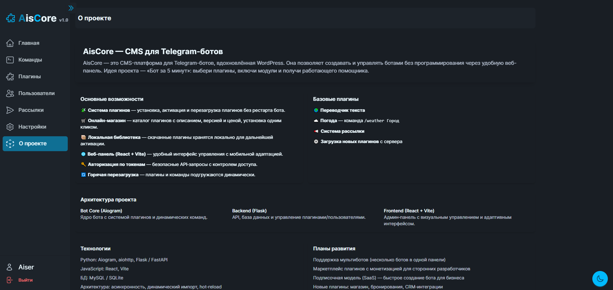
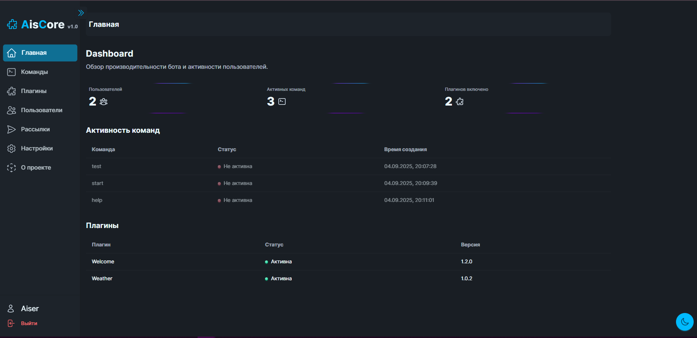
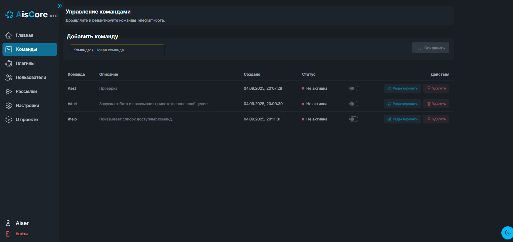
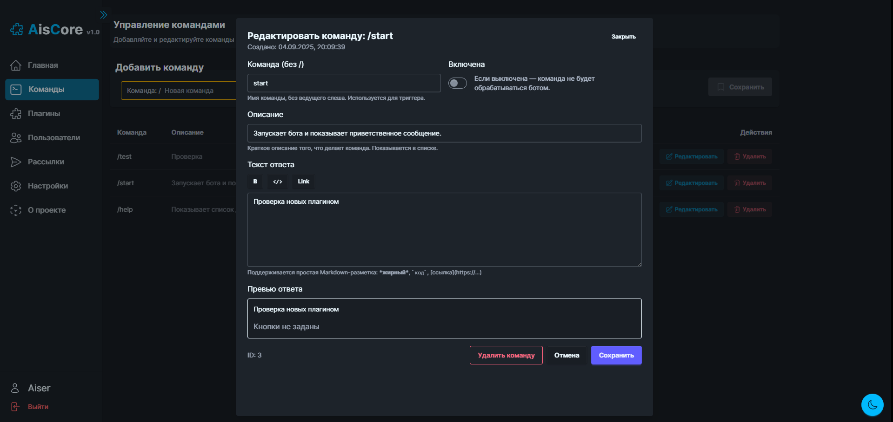
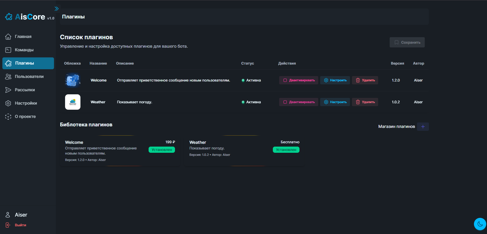
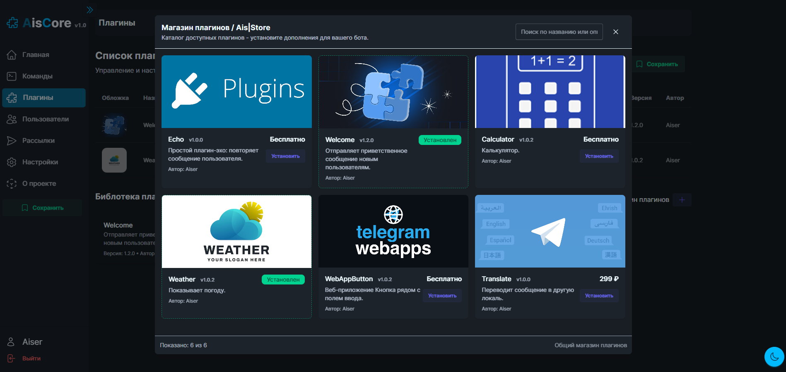
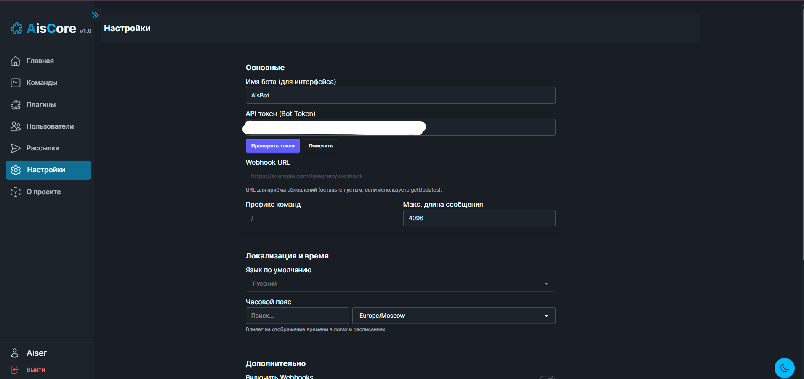

# 🚀 AisCore



**AisCore** - CMS‑платформа для Telegram‑ботов, вдохновлённая WordPress. Платформа позволяет создать и управлять ботом без программирования через удобную веб‑панель. Главная идея: «Бот за 5 минут» - выберите плагины, включите модули и получите рабочего помощника.

---

[Оглавление](#)

- О проекте
- Возможности
- Архитектура
- Технологии
- Планы развития
- Быстрый запуск
- Скриншоты
- Контакты

---

## ✨ Что такое AisCore

AisCore - это легковесная и расширяемая CMS для Telegram‑ботов. Подходит для бизнеса, сообществ и разработчиков, которые хотят быстро собрать функционального бота из готовых модулей.

> Быстрое резюме: установка плагинов, горячая перезагрузка, удобная веб‑панель и встроенная медиатека.

---

## 🔹 Основные возможности

### 🧩 Система плагинов

- Установка, активация и деактивация без рестарта бота.
- Динамическая загрузка команд и обработчиков.

### 🛒 Онлайн‑магазин плагинов

- Каталог плагинов с описанием, версией и ценой.
- Установка одним кликом.

### 📦 Локальная библиотека

- Хранение скачанных плагинов локально - активация позже.

### 🌐 Веб‑панель (React + Vite)

- Управление плагинами, командами, настройками и рассылками.
- Мобильная адаптация и современный UI.

### 🔑 Авторизация и безопасность

- API защищён токенами.
- Разделение прав и безопасное хранение ключей.

### 🔄 Горячая перезагрузка

- Обновление плагинов и команд «на лету» без простоев.

### 📢 Рассылки и медиа

- Отправка текстов, изображений, видео и документов.
- Встроенная медиатека и загрузчик.

---

## 🔌 Базовые плагины (из коробки)

- 🌍 Переводчик текста
- ☁️ Погода (команда `/weather Город`)
- 📢 Система рассылки
- ⚙️ Механизм загрузки плагинов с сервера
- 🖼️ Работа с медиа (сохранение/отправка)

---

## 🏗️ Архитектура проекта

AisCore разделён на три уровня:

- **Bot Core (Aiogram)** - ядро бота с системой плагинов и динамических команд.
- **Backend (Flask)** - API, БД и управление плагинами/пользователями.
- **Frontend (React + Vite)** - админ‑панель для управления и мониторинга.

> Дизайн ориентирован на асинхронность, динамический импорт и быструю доставку функционала.

---

## 🧰 Технологии

- Python: Aiogram, aiohttp, Flask, SQLAlchemy
- JavaScript: React, Vite, TypeScript
- БД: SQLite (или PostgreSQL, если в Docker)
- DevOps: Docker (опционально)
- Архитектура: асинхронность, динамический импорт, hot‑reload

---

## 🚧 Планы развития

- Поддержка мультиботов (несколько ботов через одну панель)
- Маркетплейс плагинов с монетизацией
- Подписочная модель (SaaS) - быстрое создание бота для бизнеса
- Новые плагины: бронирования, CRM‑интеграции и пр.

---

## ⚡ Быстрый запуск (локально)

```bash
# Клонировать репозиторий
git clone https://github.com/username/AisCore.git
cd AisCore

# Backend
cd backend
pip install -r requirements.txt
python main.py

# В отдельном терминале - Frontend
cd ../frontend
npm install
npm run dev

# Bot
cd ../bot
pip install -r requirements.txt
python main.py
```

> Docker в разработке...

---

## 🖼️ Скриншоты

<div style="display:flex;flex-wrap:wrap;gap:12px;">

  
  


  



</div>

_Больше скриншотов в папке `docs/`._

---

## 📝 Лицензия

Проект распространяется под лицензией **GNU GPL v3**. Пожалуйста, соблюдайте условия лицензии при распространении и модификации.

---

## ❤️ Автор и контакты

Проект создан Aiser (AiserKz) как pet → mini‑product. Цель сделать запуск Telegram‑бота простым и доступным для каждого.

Если нужно связаться:

- Email: aibekmiribekov0217@gmail.com
- Telegram: https://t.me/aisblackm

Буду рад фидбеку, репортам и pull‑request'ам вместе сделаем продукт лучше.

---
