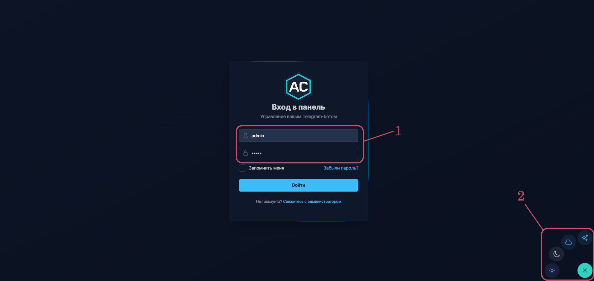
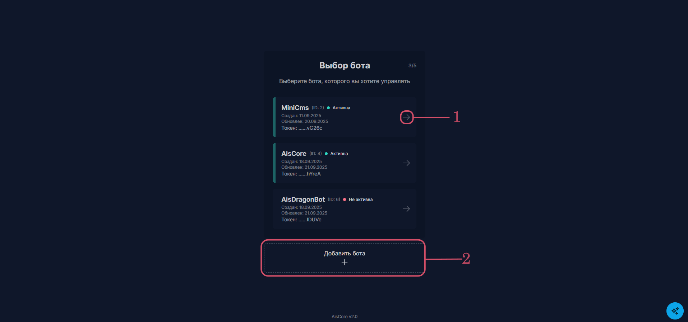
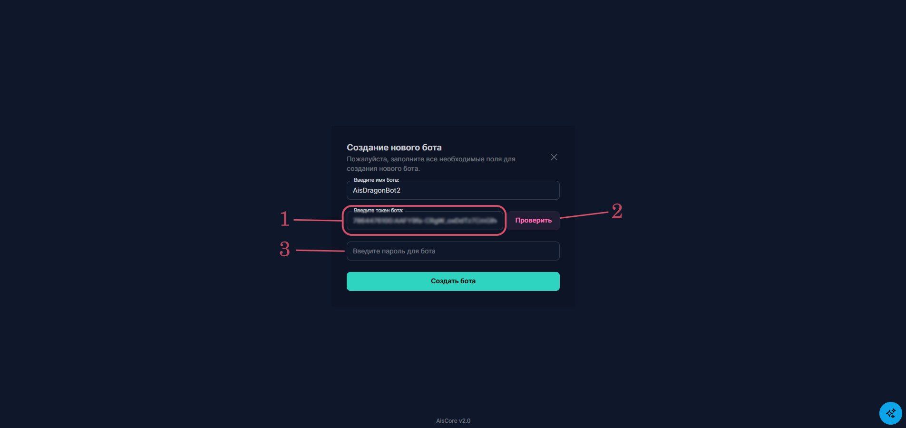
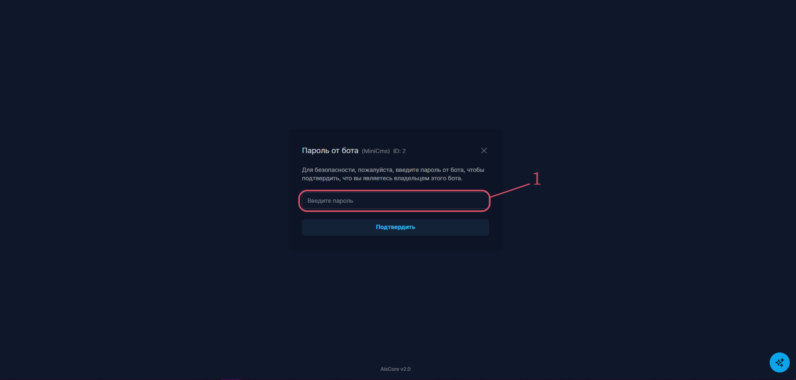
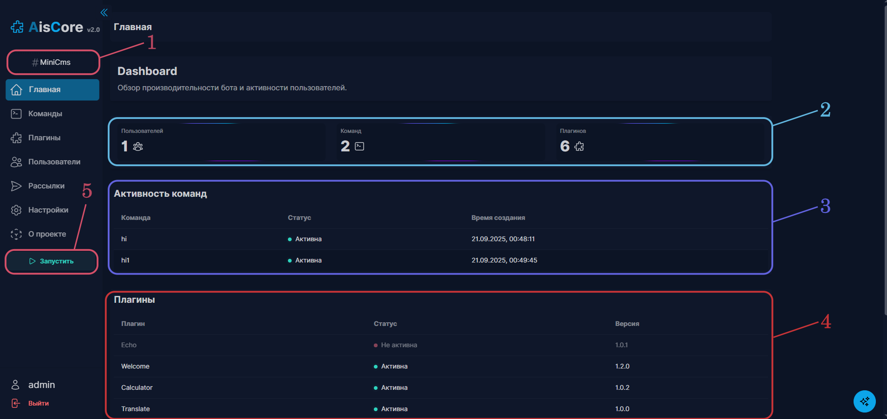
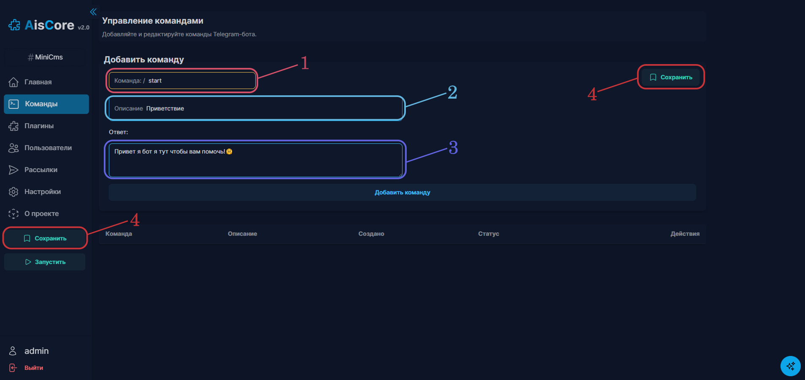
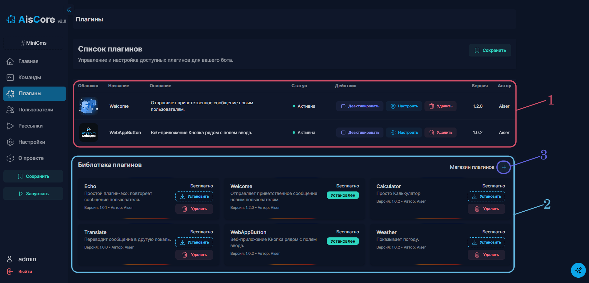
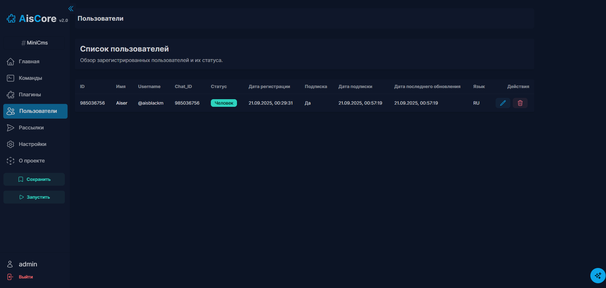
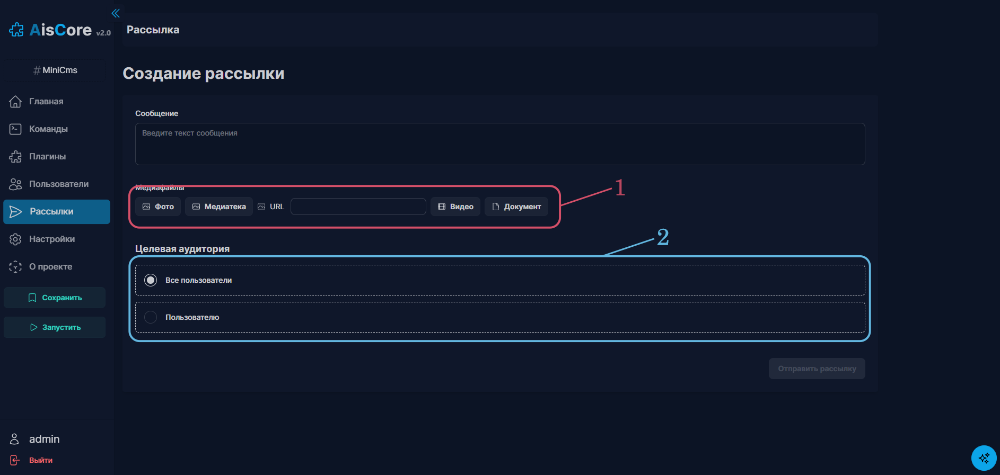

# 🚀 AisCore v2.0


**AisCore** - CMS‑платформа для Telegram‑ботов, вдохновлённая WordPress. Платформа позволяет создать и управлять ботом без программирования через удобную веб‑панель. Главная идея: «Бот за 5 минут» - выберите плагины, включите модули и получите рабочего помощника.

---

[Оглавление](#)

- О проекте
- Возможности
- Архитектура
- Технологии
- Планы развития
- Быстрый запуск
  - Локально
  - Docker
- Скриншоты
- Контакты

---

# ⚙ Обновление v2.0

- Добавлено подержка мультиботов
- Добавлено подержка мультикоманд и мультирассылок для каждого бота
- Исправлены много мелких багов
- Добавление огловление выбраного бота
- Проверка Token бота с полученим имени бота
- Общий магазин плагинов
- И много мелких улучшений

---

## ✨ Что такое AisCore

AisCore - это легковесная и расширяемая CMS для Telegram‑ботов. Подходит для бизнеса, сообществ и разработчиков, которые хотят быстро собрать функционального бота из готовых модулей.

> Быстрое резюме: установка плагинов, горячая перезагрузка, удобная веб‑панель и встроенная медиатека.

---

## 🔹 Основные возможности

# 🎥 Демо-видео


> Краткий гайд по интерфейсу AisCore

# 🌐 Демо сайт _(Временно)_

[AisCore](https://bot.aisblack.ru)

> Дефолтный логин: `admin`, пароль: `admin`

### Система мультиботов

- Создание и управление несколькими ботами.
- Плагины могут быть активными в разных ботах.
- Команды могут быть активными в разных ботах.
- Рассылки могут быть отправлены в разных ботах.

### 🧩 Система плагинов

- Установка, активация и деактивация без рестарта бота.
- Динамическая загрузка команд и обработчиков.

### 🛒 Онлайн‑магазин плагинов

- Каталог плагинов с описанием, версией и ценой.
- Установка одним кликом.

### 📦 Локальная библиотека

- Хранение скачанных плагинов локально - активация позже.

### 🌐 Веб‑панель (React + Vite)

- Управление плагинами, командами, настройками и рассылками.
- Мобильная адаптация и современный UI.

### 🔑 Авторизация и безопасность

- API защищён токенами.
- Разделение прав и безопасное хранение ключей.

### 🔄 Горячая перезагрузка

- Обновление плагинов и команд «на лету» без простоев.

### 📢 Рассылки и медиа

- Отправка текстов, изображений, видео и документов.
- Встроенная медиатека и загрузчик.

---

## 🔌 Базовые плагины (из коробки)

- 🤖 Echo
- 🌍 Translator - Переводчик текста
- ☁️ Weather - Погода (команда `/weather Город`)
- 👋 Welcome - базовый плагин для быстрого старта
- 🔗 WebAppButton - Кнопка для веб-приложений
- 🧮 Calculator - Калькулятор

---

## 🏗️ Архитектура проекта

AisCore разделён на три уровня:

- **Bot Core (Aiogram)** - ядро бота с системой плагинов и динамических команд.
- **Backend (Flask)** - API, БД и управление плагинами/пользователями.
- **Frontend (React + Vite)** - админ‑панель для управления и мониторинга.
- **Docker (опционально)** - контейнеризация проекта.
- **DB** - PostgreSQL или SQLite.

> Дизайн ориентирован на асинхронность, динамический импорт и быструю доставку функционала.

---

## 🧰 Технологии

- Python: Aiogram, aiohttp, Flask, SQLAlchemy
- JavaScript: React, Vite, TypeScript
- БД: SQLite (или PostgreSQL, если в Docker)
- DevOps: Docker (опционально)
- Архитектура: асинхронность, динамический импорт, hot‑reload

---

## 🚧 Планы развития

- Подержка отправки медиа через команды, добавление кнопок в сообщения
- Создание своих плагинов с помощью CLI
- Подписочная модель (SaaS) - быстрое создание бота для бизнеса
- Новые плагины: бронирования, CRM‑интеграции и пр.

---

## ⚡ Быстрый запуск (локально)

```bash
# Клонировать репозиторий
git clone https://github.com/username/AisCore.git
cd AisCore

# Backend
cd backend
pip install -r requirements.txt
python main.py

# В отдельном терминале - Frontend
cd frontend
npm install
npm run dev

# Bot
cd botcore
pip install -r requirements.txt
python -m bot.main
```

## ⚡ Быстрый запуск (Docker) _Рекомендуется_

```bash
# Docker
git clone https://github.com/username/AisCore.git
cd AisCore

# Стартим все сервисы в контейнерах
docker compose up --build -d

# Проверяем логи сервисов
docker compose logs -f

# После первого запуска - база будет готова, backend, frontend и bot будут доступны на портах:
# Backend: http://localhost:5002
# Bot API: http://localhost:8082
# Frontend: http://localhost:3002

# Переходим в браузере на адрес:
http://localhost:3002
```

---

## 🖼️ Скриншоты

<div style="display:flex;flex-wrap:wrap;gap:12px;">



> **Вход**  
> Здесь вы входите в систему, используя свой логин и пароль.
>
> 1. Дефолтный логин и пароль: `admin`.
> 2. Можно выбрать тему сайта.



> **Выбор бота**  
> Выберите бота, с которым хотите работать:
>
> 1. Выберите существующего бота.
> 2. Добавление нового бота.



> **Создание нового бота**  
> Добавьте нового бота и настройте его параметры:
>
> 1. Вставьте токен бота.
> 2. Нажмите «Проверить токен».
> 3. Установите пароль для входа в панель бота (можно оставить пустым).



> **Вход в панель бота**
>
> 1. Введите пароль от панели бота.
> 2. Если бот не требует пароля, оставьте поле пустым.



> **Панель управления**  
> Здесь собраны основные функции управления ботом:
>
> 1. Текущий бот.
> 2. Общая статистика.
> 3. Список команд бота.
> 4. Список плагинов.
> 5. Управление запуском и остановкой бота.



> **Добавление команды**  
> Создайте кастомные команды для вашего бота:
>
> 1. Название команды.
> 2. Описание команды для панели.
> 3. Текст ответа.
> 4. Сохранение изменений.



> **Плагины**  
> Подключайте плагины для расширения возможностей:
>
> 1. Список установленных плагинов.
> 2. Локальная библиотека плагинов.
> 3. Магазин плагинов.



> **Пользователи**  
> Просмотр статистики и управление пользователями.



> **Рассылка**  
> Отправляйте массовые сообщения всем пользователям:
>
> 1. Прикрепление медиафайлов.
> 2. Выбор аудитории для рассылки.

</div>

_Больше скриншотов в папке `docs/`._

---

## 📌 CLI

> Скоро...

## 📦 Загрузка плагинов в общий магазин

> Скоро...

---

## 📝 Лицензия

Проект распространяется под лицензией **GNU GPL v3**. Пожалуйста, соблюдайте условия лицензии при распространении и модификации.

---

## 🐛 Баги

В Проекте могут быть баги. Пожалуйста, сообщите об этом в [GitHub](https://github.com/AiserKz/AisCore-TelegramCms/issues) или [Telegram](https://t.me/aisblackm).

## ❤️ Автор и контакты

Проект создан Aiser (AiserKz) как pet → mini‑product. Цель сделать запуск Telegram‑бота простым и доступным для каждого.

Если нужно связаться:

- Email: aibekmiribekov0217@gmail.com
- Telegram: https://t.me/aisblackm

Буду рад фидбеку, репортам и pull‑request'ам вместе сделаем продукт лучше.

---
